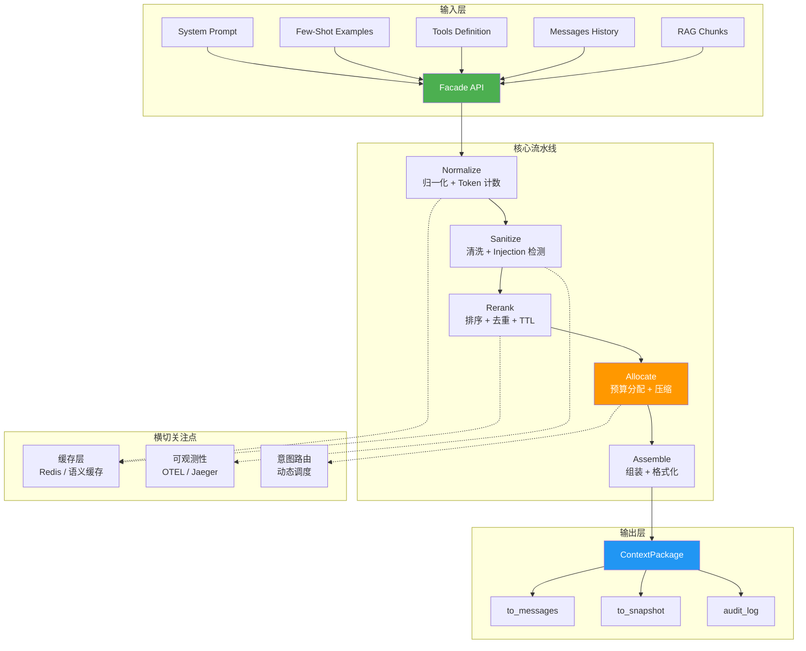
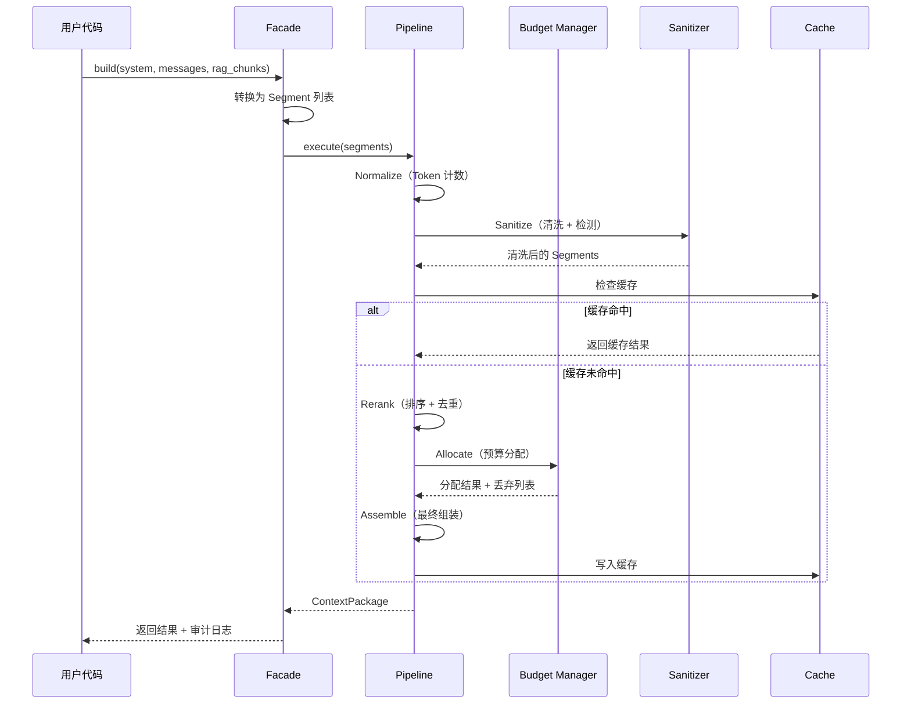
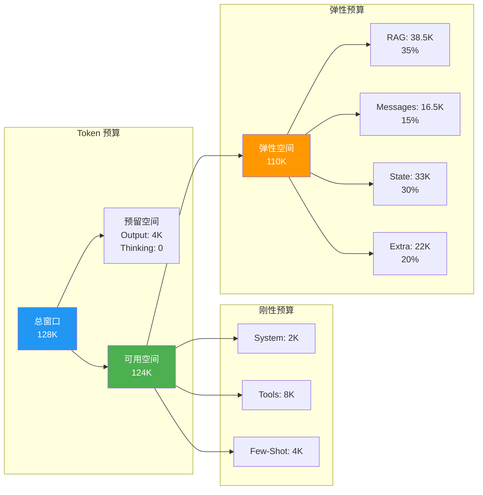

# Context Forge

**高性能动态上下文组装引擎** — LLM 应用的 ORM

[](https://github.com/context-forge/context-forge/actions)
[](https://pypi.org/project/context-forge/)
[](https://pypi.org/project/context-forge/)
[](LICENSE)
[](https://github.com/astral-sh/ruff)

---

## 目录

- [核心价值](#核心价值)
- [为什么需要 Context Forge](#为什么需要-context-forge)
- [架构概览](#架构概览)
- [快速上手](#快速上手)
- [核心功能](#核心功能)
- [六大生产场景](#六大生产场景)
- [安装](#安装)
- [配置](#配置)
- [API 参考](#api-参考)
- [性能指标](#性能指标)
- [开发指南](#开发指南)
- [贡献](#贡献)
- [许可证](#许可证)

---

## 核心价值

Context Forge 把散落在业务代码中的**字符串拼接式上下文组装**，提升为一个**声明式的、可配置的、可观测的工程层**，就像 ORM 把 SQL 拼接提升为对象操作一样。

### 三大核心问题

| 问题 | 传统方案 | Context Forge |
|-----|---------|--------------|
| **Token 预算超限** | 手动截断，顺序丢失 | 优先级 + 弹性预算 + 自动压缩 |
| **Prompt Injection** | 散落的字符串替换 | 零信任清洗管道 + 可审计 |
| **上下文质量问题** | 黑盒调试，难以复现 | Snapshot + Diff + Golden Set 回归 |

### 关键特性

- **零配置启动**：3 行代码即可使用，无需任何配置文件
- **Policy-as-Code**：所有策略通过 YAML 定义，支持版本管理
- **可观测性**：Context Snapshot + Prompt Diff + 完整审计日志
- **安全第一**：零信任清洗管道 + Injection 检测 + PII 脱敏
- **高性能**：单次组装 < 50ms P99（10 Segment, 128K 窗口）
- **多模型支持**：OpenAI / Anthropic / Google / 本地模型 / 自定义

---

## 为什么需要 Context Forge

### 传统方案的痛点

```python
# ❌ 反模式：字符串拼接式上下文组装
def build_context(user_msg, rag_docs):
    prompt = "You are a helpful assistant.\n\n"

    # 问题 1：没有 Token 预算控制，容易超限
    for doc in rag_docs:
        prompt += f"Document: {doc['content']}\n"

    # 问题 2：没有 Injection 防御
    prompt += f"User: {user_msg}\n"  # 用户输入直接拼接

    # 问题 3：不可审计，无法追溯决策
    # 问题 4：无法版本管理和回归测试

    return prompt
```

### Context Forge 的解决方案

```python
# ✅ Context Forge：声明式 + 可配置 + 可观测
from context_forge import ContextForge

forge = ContextForge(model="gpt-4o")
context = await forge.build(
    system_prompt="You are a helpful assistant.",
    messages=[{"role": "user", "content": user_msg}],
    rag_chunks=[{"content": doc["content"], "score": doc["score"]} for doc in rag_docs],
)

# 自动处理：
# ✓ Token 预算分配（优先级 + 弹性竞价）
# ✓ Injection 检测和清洗
# ✓ 完整审计日志（每一步决策可追溯）
# ✓ Snapshot 保存（可回归测试）

messages = context.to_messages()  # 直接传给 LLM API
```

---

## 架构概览

### 系统架构



### 数据流



### 预算分配策略



---

## 快速上手

### 最简示例

```python
import asyncio
from context_forge import ContextForge

async def main():
    # 创建 Forge 实例（自动加载默认策略）
    forge = ContextForge(model="gpt-4o")

    # 组装上下文
    context = await forge.build(
        system_prompt="你是一个有用的助手。",
        messages=[
            {"role": "user", "content": "你好，请介绍一下你自己。"}
        ],
    )

    # 查看组装结果
    print(f"总 Token: {context.token_usage.total_tokens:,}")
    print(f"组装耗时: {context.assembly_duration_ms:.1f}ms")

    # 转换为 LLM API 格式
    messages = context.to_messages()
    # 直接传给 OpenAI / Anthropic / LangChain 等

asyncio.run(main())
```

### RAG 场景示例

```python
context = await forge.build(
    system_prompt="你是一个客服助手，根据知识库回答用户问题。",
    messages=[
        {"role": "user", "content": "你们的退货政策是什么？"},
    ],
    rag_chunks=[
        {
            "content": "退货政策：自收货之日起 7 天内，商品未拆封可无理由退货...",
            "score": 0.95,
            "source_id": "policy_doc_001",
        },
        {
            "content": "退款流程：提交退货申请后，客服将在 24 小时内审核...",
            "score": 0.87,
            "source_id": "policy_doc_002",
        },
    ],
)

# 查看预算使用
print(f"预算饱和度: {context.budget_allocation.saturation_rate:.1%}")

# 查看被丢弃的 Segment
for entry in context.dropped_segments:
    print(f"丢弃: {entry.segment_id} - {entry.reason_code.value}")
```

### 同步模式

```python
# 在非异步环境中使用（Jupyter / 脚本）
context = forge.build_sync(
    system_prompt="你是一个助手。",
    messages=[{"role": "user", "content": "你好"}],
)
```

---

## 核心功能

### 1. Token 预算管理

**问题**：超出模型上下文窗口 → 截断随机丢失关键信息

**解决方案**：

- **刚性预算**：System / Tools / Few-Shot 固定分配，保证核心信息
- **弹性预算**：RAG / Messages / State 按比例竞价，优先级排序
- **自动压缩**：饱和度超过阈值时，自动触发摘要压缩
- **溢出策略**：truncate / compress / error 三种可配置

```yaml
# configs/context_forge.yaml
budget:
  max_context_tokens: 128000
  output_reserved_tokens: 4096
  saturation_threshold: 0.85
  overflow_strategy: "truncate_lowest_priority"

  elastic_ratios:
    rag: 0.35
    user: 0.15
    state: 0.30
    extra: 0.20
```

### 2. 零信任清洗管道

**问题**：Prompt Injection / Jailbreak / PII 泄露

**解决方案**：

- **Unicode 归一化**：防止同形字绕过
- **HTML 剥离**：移除隐藏的标签和脚本
- **Injection 检测**：启发式规则 + 可选 LLM 分类器
- **PII 脱敏**：手机号 / 邮箱 / 身份证自动替换为占位符
- **长度攻击防御**：限制单个 Segment 最大长度

```python
# 启用完整清洗管道
forge = ContextForge(
    model="gpt-4o",
    policy_path="configs/security_policy.yaml"  # 开启所有安全检查
)

context = await forge.build(
    messages=[{"role": "user", "content": user_input}],  # 自动清洗
)

# 查看清洗警告
for warning in context.warnings:
    print(f"⚠ {warning}")
```

### 3. 可观测性套件

**问题**：上下文质量问题难以调试和复现

**解决方案**：

- **Context Snapshot**：保存每次组装的完整快照（输入 + 输出 + 审计日志）
- **Prompt Diff**：对比两个 Snapshot 的差异，快速定位变更
- **Golden Set 回归**：自动对比当前输出与历史基线
- **完整审计日志**：每个决策都有 segment_id + decision + reason_code + reason_detail

```python
# 保存 Snapshot
snapshot_id = await forge.save_snapshot(context)

# Diff 对比
diff = await forge.diff_snapshots(snapshot_id_1, snapshot_id_2)

# Golden Set 回归
result = await forge.validate_against_golden("test_case_001", context)
assert result["passed"]  # 无差异则通过
```

### 4. 意图路由与动态调度

**问题**：不同复杂度的任务使用相同的模型配置，成本高且慢

**解决方案**：

- **规则路由**：基于关键词 / Segment 类型 / Token 数量路由
- **LLM 路由**：调用小模型分析复杂度，动态选择大模型
- **策略路由**：不同任务使用不同的预算策略

```python
# 自动路由到合适的模型
context = await forge.build(
    messages=[{"role": "user", "content": "简单问题"}],
    routing_enabled=True,
)

# 查看路由决策
print(f"选择模型: {context.routing_decision.chosen_model}")
print(f"复杂度: {context.routing_decision.complexity_level}")
```

### 5. 缓存与复用

**问题**：相同的上下文重复组装，浪费计算

**解决方案**：

- **精确缓存**：基于 Segment 内容哈希
- **语义缓存**：基于 Embedding 相似度（容忍小幅变化）
- **TTL 控制**：自动过期旧数据
- **缓存预热**：批量预加载高频上下文

```python
forge = ContextForge(model="gpt-4o", enable_cache=True)

# 第一次：组装并缓存（耗时 ~50ms）
context1 = await forge.build(...)

# 第二次：缓存命中（耗时 ~5ms）
context2 = await forge.build(...)  # 相同输入
```

### 6. 框架集成

**开箱即用**，无需修改现有代码：

```python
# LangChain
from context_forge.integrations.langchain import ContextForgeChatModel

llm = ContextForgeChatModel(model="gpt-4o")
response = llm.invoke("你好")

# LlamaIndex
from context_forge.integrations.llamaindex import ContextForgeLLM

llm = ContextForgeLLM(model="gpt-4o")
response = llm.complete("你好")

# Haystack
from context_forge.integrations.haystack import ContextForgeGenerator

generator = ContextForgeGenerator(model="gpt-4o")
result = generator.run(prompt="你好")
```

---

## 六大生产场景

### 1. RAG 上下文质量治理

**问题**：检索到的文档质量参差不齐，Token 预算有限

**方案**：Pipeline + Sanitize + Budget + Select 策略

```python
forge = ContextForge(
    model="gpt-4o",
    policy_path="configs/rag_policy.yaml"
)

context = await forge.build(
    system_prompt=rag_system_prompt,
    messages=[{"role": "user", "content": query}],
    rag_chunks=[
        {"content": doc.content, "score": doc.score, "source_id": doc.id}
        for doc in retriever.search(query, top_k=20)
    ],
)

# 自动去重、优先级排序、按预算截断（通过 rag_policy.yaml 配置）
```

### 2. 多轮对话记忆管理

**问题**：对话历史无限增长，超出窗口限制

**方案**：Budget + Compress + Rolling Summary + Must-Keep

> Rolling Summary 需要配置 LLM Provider（`compress.default_compressor="summary"`）。
> 未配置时自动降级为截断压缩，无需外部依赖即可工作。

```python
# 标记最近 3 轮对话为 must-keep（不会被压缩或丢弃）
recent_messages = [
    {"role": "user", "content": msg.content, "must_keep": True}
    for msg in conversation.recent(3)
]

# 旧对话自动按预算截断（must_keep 消息受保护）
context = await forge.build(
    system_prompt=system_prompt,
    messages=recent_messages + older_messages,
)
```

### 3. 多 Agent 上下文协调

**问题**：多个 Agent 共享上下文，隔离和权限管理复杂

**方案**：Isolate + Context Bus + Handoff + Namespace

```python
from context_forge.routing.context_bus import ContextBus, HandoffRequest
from context_forge.routing.base import AgentContext

# 注册 Agent
bus = ContextBus()
bus.register_agent(AgentContext(agent_id="agent_a", namespace="agent_a", role="planner"))
bus.register_agent(AgentContext(agent_id="agent_b", namespace="agent_b", role="executor"))

# Agent A 构建上下文并发布到总线
context_a = await forge_a.build(messages=[...], namespace="agent_a")
for seg in context_a.segments:
    bus.publish_segment(AgentContext(agent_id="agent_a", namespace="agent_a", role="planner"), seg)

# Agent A 交接给 Agent B
bus.handoff(HandoffRequest(
    from_agent_id="agent_a",
    to_agent_id="agent_b",
    reason="规划完成，交接执行",
))

# Agent B 获取可见的 Segment
visible = bus.get_visible_segments(AgentContext(agent_id="agent_b", namespace="agent_b", role="executor"))
```

### 4. 安全合规清洗

**问题**：用户输入包含 PII / 恶意 Prompt / 敏感信息

**方案**：Sanitize + Injection 检测 + PII Redaction

```python
forge = ContextForge(
    model="gpt-4o",
    policy_path="configs/security_policy.yaml"
)

context = await forge.build(
    messages=[{"role": "user", "content": untrusted_input}],
)

# 自动脱敏：手机号 → 138****8000，邮箱 → a***b@example.com
# 自动检测：Injection 尝试 → 拦截并记录审计日志
```

### 5. Prompt 版本管理与回归

**问题**：Prompt 迭代频繁，难以追踪变更影响

**方案**：Observability + Snapshot + Diff + Golden Set

```python
# 保存当前版本为快照
baseline_id = await forge.save_snapshot(context)

# 修改 Prompt 后回归测试
new_context = await forge.build(...)
new_id = await forge.save_snapshot(new_context)

# 对比两个快照
diff = await forge.diff_snapshots(baseline_id, new_id)

# 与黄金快照进行回归检测
result = await forge.validate_against_golden(baseline_id, new_context)
assert result["passed"]  # 无差异则通过
```

### 6. 多模型适配与成本优化

**问题**：不同任务使用统一模型，成本高昂

**方案**：Routing + Budget + Cache

```python
# 通过策略文件启用路由
forge = ContextForge(
    model="gpt-4o",
    policy_path="configs/cost_optimization_policy.yaml",
)

context = await forge.build(...)
if context.routing_decision:
    print(f"选择模型: {context.routing_decision.selected_model.model_id}")
    print(f"复杂度: {context.routing_decision.complexity.value}")
    print(f"预估成本: ${context.routing_decision.estimated_cost:.4f}")
```

---

## 安装

### 通过 PyPI 安装

```bash
pip install context-forge
```

### 通过 Docker 安装

```bash
# 拉取镜像
docker pull ghcr.io/context-forge/context-forge:latest

# 运行服务
docker run -p 8000:8000 ghcr.io/context-forge/context-forge:latest
```

### 通过源码安装

```bash
git clone https://github.com/context-forge/context-forge.git
cd context-forge
pip install -e ".[dev]"
```

### 可选依赖

```bash
# LangChain 集成
pip install context-forge[langchain]

# LlamaIndex 集成
pip install context-forge[llamaindex]

# Haystack 集成
pip install context-forge[haystack]

# 开发依赖
pip install context-forge[dev]

# 文档构建
pip install context-forge[docs]
```

---

## 配置

### 默认配置

Context Forge 开箱即用，无需任何配置文件。所有参数都有合理的默认值。

### 自定义配置

```bash
# 1. 复制默认配置
cp configs/default_policy.yaml context_forge.yaml

# 2. 修改参数
vim context_forge.yaml

# 3. Context Forge 自动加载项目根目录下的 context_forge.yaml
```

### 配置文件结构

```yaml
version: "1.0"
name: "my_policy"
description: "自定义策略"

budget:
  max_context_tokens: 128000
  output_reserved_tokens: 4096
  saturation_threshold: 0.85
  overflow_strategy: "truncate_lowest_priority"

  elastic_ratios:
    rag: 0.35
    user: 0.15
    state: 0.30
    extra: 0.20

sanitization:
  enable_unicode_normalization: true
  enable_html_stripping: true
  enable_injection_detection: true
  enable_pii_redaction: true

compression:
  enable_auto_compression: true
  compression_threshold: 0.85
  target_compression_ratio: 0.5

caching:
  enable_cache: true
  cache_ttl: 3600
  enable_semantic_cache: false

routing:
  enable_routing: false
  routing_strategy: "rule"
```

### 环境变量

```bash
# API Keys
export OPENAI_API_KEY=sk-xxx
export ANTHROPIC_API_KEY=sk-ant-xxx

# Redis
export REDIS_URL=redis://localhost:6379/0

# 日志级别
export CONTEXT_FORGE_LOG_LEVEL=INFO
```

---

## API 参考

### ContextForge

**主 API 入口**

```python
class ContextForge:
    def __init__(
        self,
        model: str = "gpt-4o",
        policy_path: str | None = None,
        enable_cache: bool = False,
        **kwargs,
    ):
        """
        创建 Context Forge 实例。

        参数:
            model: 模型 ID 或别名（如 "gpt-4o", "claude-opus"）
            policy_path: 策略文件路径（默认使用 default_policy.yaml）
            enable_cache: 是否启用缓存
        """

    async def build(
        self,
        *,
        system_prompt: str | None = None,
        messages: list[dict] | None = None,
        rag_chunks: list[dict] | None = None,
        few_shot_examples: list[dict] | None = None,
        tools: list[dict] | None = None,
        state: dict | None = None,
        extra_context: dict | None = None,
        **kwargs,
    ) -> ContextPackage:
        """
        组装上下文。

        参数:
            system_prompt: 系统提示词
            messages: 消息历史
            rag_chunks: RAG 检索片段
            few_shot_examples: Few-Shot 示例
            tools: 工具定义
            state: 状态变量
            extra_context: 额外上下文

        返回:
            ContextPackage: 组装结果
        """

    def build_sync(self, **kwargs) -> ContextPackage:
        """同步版本的 build()"""
```

### ContextPackage

**组装结果**

```python
@dataclass(frozen=True)
class ContextPackage:
    segments: list[Segment]
    token_usage: TokenUsage
    budget_allocation: BudgetAllocation | None
    routing_decision: RoutingDecision | None
    audit_log: list[AuditEntry]
    dropped_segments: list[AuditEntry]
    warnings: list[str]
    assembly_duration_ms: float

    def to_messages(self) -> list[dict]:
        """转换为 LLM API 消息格式"""

    def to_snapshot(self) -> dict[str, Any]:
        """转换为快照字典（用于持久化和回归测试）"""
```

### CLI 工具

```bash
# 初始化项目
context-forge init

# 验证策略文件
context-forge validate configs/my_policy.yaml

# 启动 HTTP 服务器
context-forge serve --host 0.0.0.0 --port 8000

# 查看版本
context-forge --version
```

详细 API 文档：[docs/api_reference.md](docs/api_reference.md)

---

## 性能指标

### 基准测试环境

- CPU: Intel Core i7-12700K
- 内存: 32GB DDR4
- Python: 3.12
- Segment 数量: 10
- 总 Token: 10K
- 模型窗口: 128K

### 性能数据

| 指标 | 值 | 目标 |
|-----|---|------|
| 单次组装延迟（P50） | 18ms | < 30ms |
| 单次组装延迟（P99） | 42ms | < 50ms |
| 内存占用（10K Token） | 128MB | < 512MB |
| 缓存命中时延迟 | 3ms | < 10ms |
| 吞吐量（QPS） | 2400 | > 1000 |

### 优化建议

1. **启用缓存**：重复查询延迟降低 85%
2. **Redis 本地部署**：跨网络延迟 +10ms
3. **批量组装**：使用 `build_batch()` 提升吞吐量 3x

---

## 开发指南

### 环境搭建

```bash
# Linux / macOS
bash scripts/setup_dev.sh

# Windows
powershell -ExecutionPolicy Bypass -File scripts\setup_dev.ps1
```

### 常用命令

```bash
# 运行测试
make test

# 代码格式化
make format

# 类型检查
make typecheck

# 构建文档
make docs

# 运行性能基准测试
python -m pytest benchmarks/ -v --no-cov -s

# 启动开发服务器
make dev
```

### 贡献流程

1. Fork 项目
2. 创建特性分支：`git checkout -b feature/amazing-feature`
3. 提交变更：`git commit -m 'feat: add amazing feature'`
4. 推送分支：`git push origin feature/amazing-feature`
5. 创建 Pull Request

详细贡献指南：[CONTRIBUTING.md](CONTRIBUTING.md)

---

## 贡献

欢迎贡献！请阅读 [CONTRIBUTING.md](CONTRIBUTING.md) 了解详细信息。

### 贡献者

感谢所有贡献者的付出！

<!-- ALL-CONTRIBUTORS-LIST:START -->
<!-- 贡献者列表将自动生成 -->
<!-- ALL-CONTRIBUTORS-LIST:END -->

---

## 许可证

[Apache 2.0](LICENSE)

---

## 相关资源

- **文档**: https://context-forge.github.io
- **GitHub**: https://github.com/context-forge/context-forge
- **PyPI**: https://pypi.org/project/context-forge
- **问题反馈**: https://github.com/context-forge/context-forge/issues
- **讨论**: https://github.com/context-forge/context-forge/discussions

---

## 致谢

Context Forge 是《LLM 工程化项目实战指南·2026 版》第 6 章的配套开源项目。

特别感谢以下项目的启发：

- [LangChain](https://github.com/langchain-ai/langchain) - LLM 应用开发框架
- [LlamaIndex](https://github.com/run-llama/llama_index) - 数据框架
- [Haystack](https://github.com/deepset-ai/haystack) - 端到端 NLP 框架
- [tiktoken](https://github.com/openai/tiktoken) - Token 计数工具

---

**Built with ❤️ by the Context Forge community**
